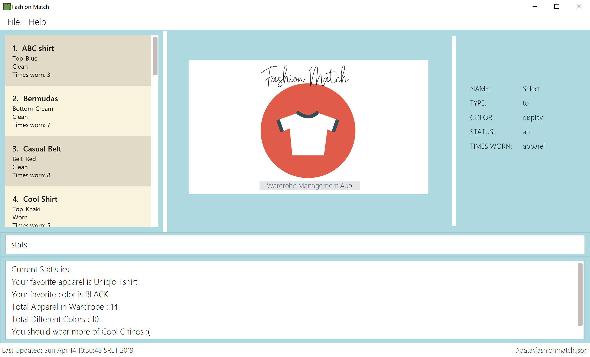

= Fashion Match
ifdef::env-github,env-browser[:relfileprefix: docs/]

https://travis-ci.org/cs2103-ay1819s2-w15-1/main[image:https://travis-ci.org/CS2103-AY1819S2-W15-1/main.svg?branch=master[Build Status]]
https://coveralls.io/github/CS2103-AY1819S2-W15-1/main?branch=master[image:https://coveralls.io/repos/github/CS2103-AY1819S2-W15-1/main/badge.svg?branch=master[Coverage Status]]

ifdef::env-github[]

endif::[]

ifndef::env-github[]

endif::[]

* This is a desktop Fashion Match application. It has a GUI but most of the user interactions happen using a CLI (Command Line Interface).

== Site Map

* <<UserGuide#, User Guide>>
* <<DeveloperGuide#, Developer Guide>>
* <<AboutUs#, About Us>>
* <<ContactUs#, Contact Us>>

== Target Users
* People who wants to have an easy solution for matching of everyday apparels.
* People who does not want to spend too much time thinking about whether his choice of outfit actually matches correctly.
* People who want to know the alternative matching combination to his current choice of base apparel.

== Why You Should Totally Use This
* Lower the risk of being **unfashionable**.
* Recommendation of matching apparels with just a few commands given.
* Use the time spent for planning of matching apparels on something more productive.
* When you look good, you feel good.

== Acknowledgements
* Some parts of this sample application were inspired by the excellent http://code.makery.ch/library/javafx-8-tutorial/[Java FX tutorial] by
_Marco Jakob_.
* Libraries used: https://github.com/TestFX/TestFX[TextFX], https://github.com/FasterXML/jackson[Jackson], https://github.com/google/guava[Guava], https://github.com/junit-team/junit5[JUnit5]
* This project is modification of https://github.com/se-edu/addressbook-level4[AddressBook-Level4 project] created by SE-EDU initiative at https://github.com/se-edu/

== Licence : link:LICENSE[MIT]
